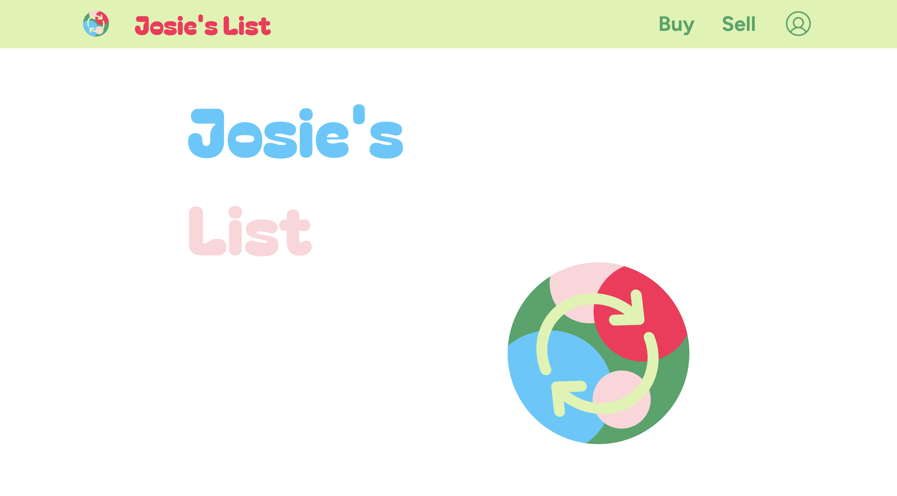
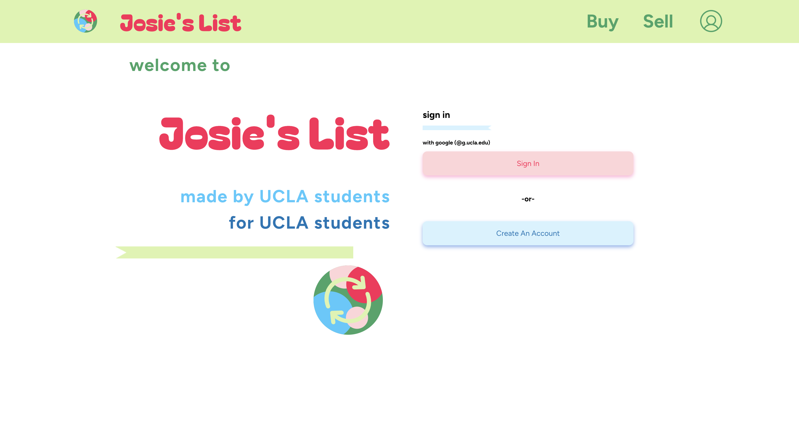
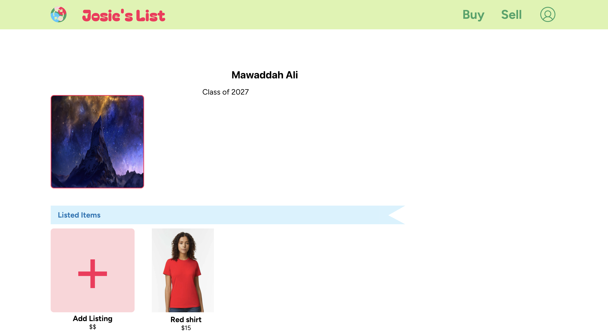
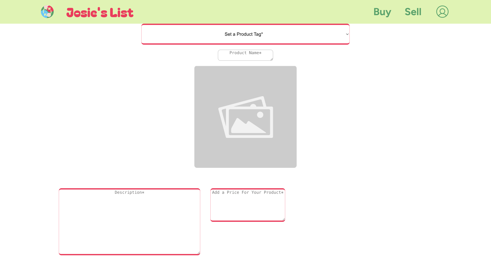
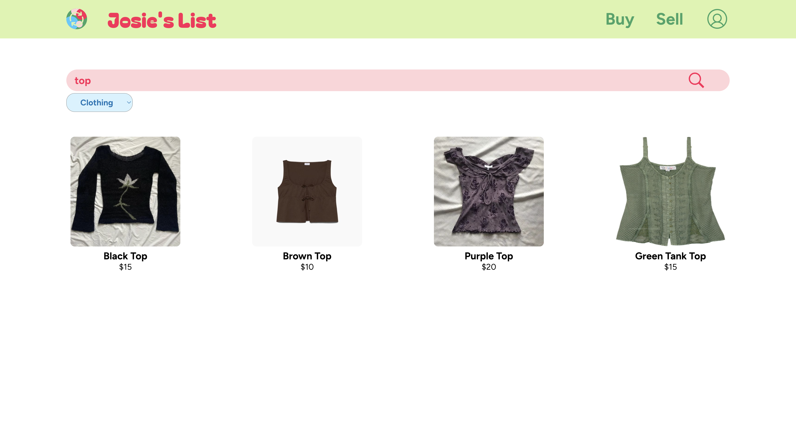
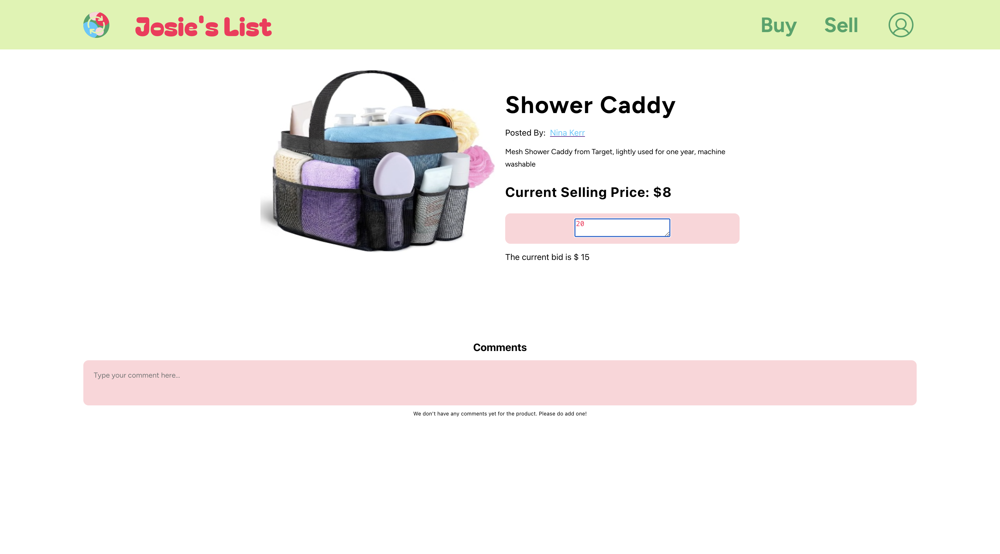

# Josie's List
35L collaborative project Fall 2024

## Description
Josie's List is a localized marketplace for UCLA students to buy and sell items in 
different categories such as clothing, textbooks, and dorm items.

## Key Features
- User Authentication & Profile:
1. Users can create profiles that enable them to sign up, login, add biographies, add a profile picture,
and sell and buy products. All users will be required to provide a valid UCLA
email address for authentication.
- Selling Products:
2. Users can create listings for products they wish to sell. A listing includes a picture of 
the item, a description of it, and its price.
- Searching for Products:
3. Users can search for items/products using tags, item names, descriptions, etc.
- Comment on Products:
4. Users can comment on posts of items.
- Bidding:
5. Users can make bidding offers on items they wish to buy. Sellers can see the highest bid made and the email of the buyer 
who made that bid, buyers can see the current highest bid for an item/product. Sellers can mark an item as sold.

## Tech Stack
- Frontend: React, JavaScript, CSS, HTML
- Backend: Node.js, Express.js, mongoose
- Database: MongoDB

## Steps to Set Up Locally
1. Clone the repository:

```
git clone https://github.com/Nikita2662/josies-list.git
cd josies-list
```
2. Install dependencies for the backend:

```
cd back-end
npm install
```

3. Navigate to the frontend directory and install dependencies:

```
cd front-end 
npm install
```

4. To connect your application to a database, create a .env file in the back-end directory 
and add your MongoDB URI in the following format
```
DATABASE_URI= <your_mongo_db_URI>
```
Make sure you replace <your_mongo_db_URI> with the actual connection string for your MongoDB database.

5. Start the backend and frontend servers:

Backend:

```
cd back-end
npm start
```
Frontend:

```
cd front-end
npm start
```

6. Visit the app in your browser at http://localhost:3000.

## Usage

How to Use:
- Sign up or log in using a valid UCLA email address.
- Personalize your profile by adding a profile picture, and a biography.
- Create product listings by adding an image, description, and price for a product you wish to sell.
- Browse available items using the search bar.
- Comment on listings to engage with sellers.
- Make offers/bids on items you want to buy and wait for seller responses.
- View highest bid on your item/product and accept offer, marking product as sold.

Screenshots:
- Landing Page:

- Sign In/Sign Up Page:

- User Profile Page:

- Sell Page:

- Search Page:

- Listing Page:
